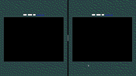

# Multiplayer snake game

Two players can join and communicate through websocket. Game state is kept 
on the server side. Using actix web and actor model, based on the
[actix chat server example](https://github.com/actix/examples/tree/master/websockets/chat)

